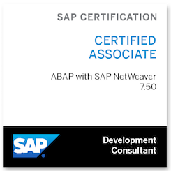

<!-- Reference readme: https://github.com/wookyoungkim/wookyoungkim/tree/main -->

<!-- Open API: https://github.com/kyechan99/capsule-render#wave -->

<h3 align="left"> 🙇‍♂️ Introduce 🙇‍♂️ </h3>

My name is <b>Youjun Seo</b> 
I am an undergraduate student at Soongsil University, Seoul, Republic of Korea. 

_서두르지 않고_ 
_유연하게 상황을 대처하며_ 
_준수한 코딩 실력을 가지고 싶은 서유준입니다._
  

 

🏆 수상
기간|프로젝트명|프로젝트 소개|역할|수상명(주최기관)|
:---|:---|:---|:---|:---|
23.09.01 ~ 23.12.22| Co-op SAP 트랙   (캡스톤 디자인)| MM 모듈 프로젝트 | 개인 프로젝트 기획 및 구현 | 23-2 Co-op 장학생 선발   (SAP, 숭실대학교)

🏃 경험
기간|활동명|프로젝트명 | 활동 |기관|
:---|:---|:---|:---|:---|
23.09.01 ~ 23.12.22| Co-op SAP 트랙 | SAP ABAP 개발, MM 모듈| SAP, 숭실대학교

🪪 자격증
취득일자|자격증명|
:---|:---|
23.12.20|SAP Abap Certification

<!-- Open API: https://github.com/anuraghazra/github-readme-stats/blob/master/themes/README.md -->

<h3 align="left"> 💯 Certificate 💯 </h3>

SAP Certified Development Associate: ABAP with SAP NetWeaver 7.50 

 
  

  </a>&nbsp

<h3 align="left">🛠 Tech Stack 🛠</h3>

 📋 Languages 

  </a>&nbsp 
  </a>&nbsp 
  </a>&nbsp 
  </a>&nbsp 
  </a>&nbsp
  </a>&nbsp 

 🎛️ Operating System 

  </a>&nbsp
  </a>&nbsp
  </a>&nbsp

  

 📚 Frameworks, Platforms and Libraries 

  </a>&nbsp 
  </a>&nbsp 
  </a>&nbsp

 💻 IDEs/Editors 

  </a>&nbsp 
  </a>&nbsp
  
  
  

 💾 Databases 

  </a>&nbsp 

 ☁️ Hosting/SaaS 

  </a>&nbsp 

 
<!-- Use Badge: https://shields.io/ -->
<!-- Use Icon: https://simpleicons.org/ -->

<h3 align="left"> :stars: SNS :stars: </h3>

  &nbsp
  &nbsp
  

 

<h3 align="left">  :memo: Blog :memo: </h3>

  
  

<!-- Open API: https://hits.seeyoufarm.com/ -->

